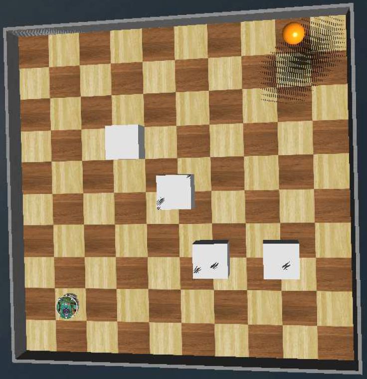

# Astar-path-planning
 

This Webots project simulates path planning for a mobile robot using an A* search algorithm. Planning is implemented using Python and is carried out by an overseer agent, which then communicates motion commands to the robot, whose controller is implemented using C. For more details, please read the corresponding [simulation results paper](https://www.researchgate.net/publication/329684570_Simulation_of_e-puck_path_planning_in_webots).

The source files in this project are registered on my behalf as former member of the [DAVINCI Research Group at Unversidad Militar Nueva Granada](https://www.umng.edu.co/sedes/bogota/facultad-de-ingenieria/centro-de-investigacion/davinci), and are thus confidential and for demonstration purposes only. Please refer to the [license](./LICENSE) for more details.

To interact with the simulation, you must install Webots and perform the following steps:

1. Download all repository files.
2. In Webots, choose the "Open project" option and choose the "mundo_webots.wbt" file located in the "worlds" folder.
3. Start and control the simulation using Webots' controls.
